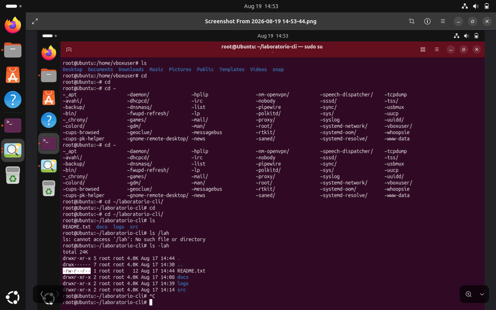

### README.txt (`-rw-r--r--`) → 644

  Permiso      Dueño   Grupo   Otros
  ----------- ------- ------- -------
  Lectura       Sí      Sí      Sí
  Escritura     Sí      No      No
  Ejecución     No      No      No

### docs (`drwxr-xr-x`) → 755

  Permiso      Dueño   Grupo   Otros
  ----------- ------- ------- -------
  Lectura       Sí      Sí      Sí
  Escritura     Sí      No      No
  Ejecución     Sí      Sí      Sí

### logs (`drwxr-xr-x`) → 755

  Permiso      Dueño   Grupo   Otros
  ----------- ------- ------- -------
  Lectura       Sí      Sí      Sí
  Escritura     Sí      No      No
  Ejecución     Sí      Sí      Sí

### src (`drwxr-xr-x`) → 755

  Permiso      Dueño   Grupo   Otros
  ----------- ------- ------- -------
  Lectura       Sí      Sí      Sí
  Escritura     Sí      No      No
  Ejecución     Sí      Sí      Sí
