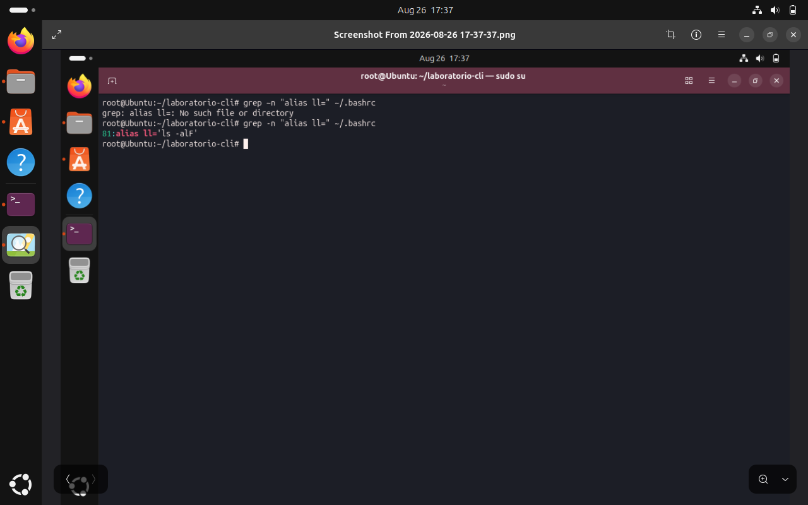
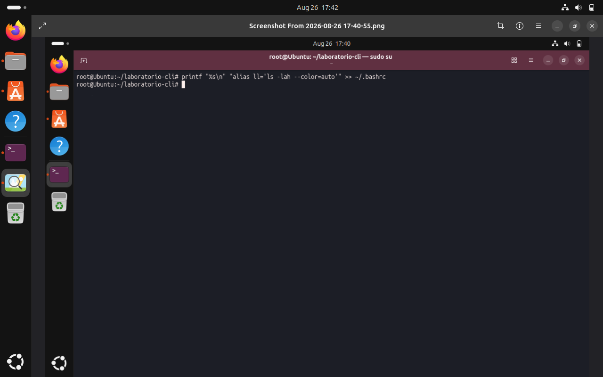
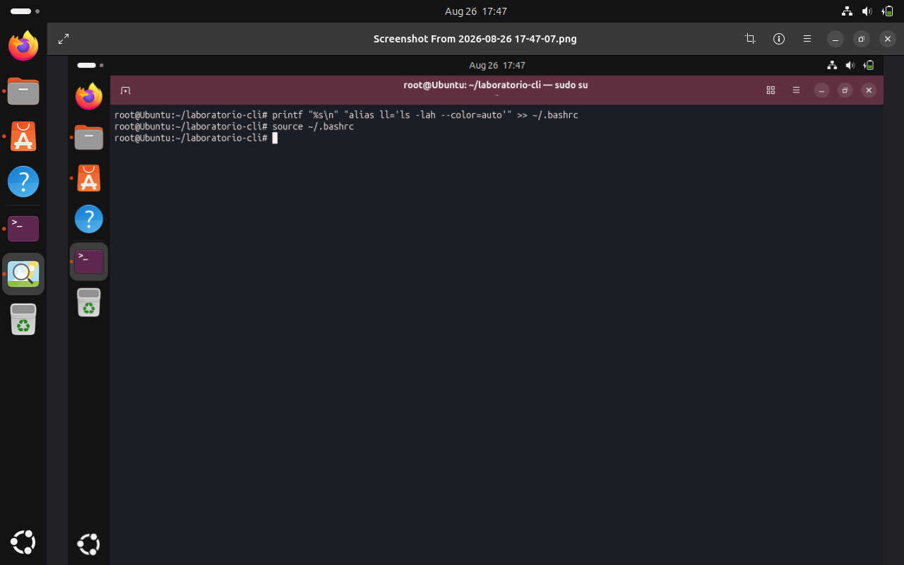
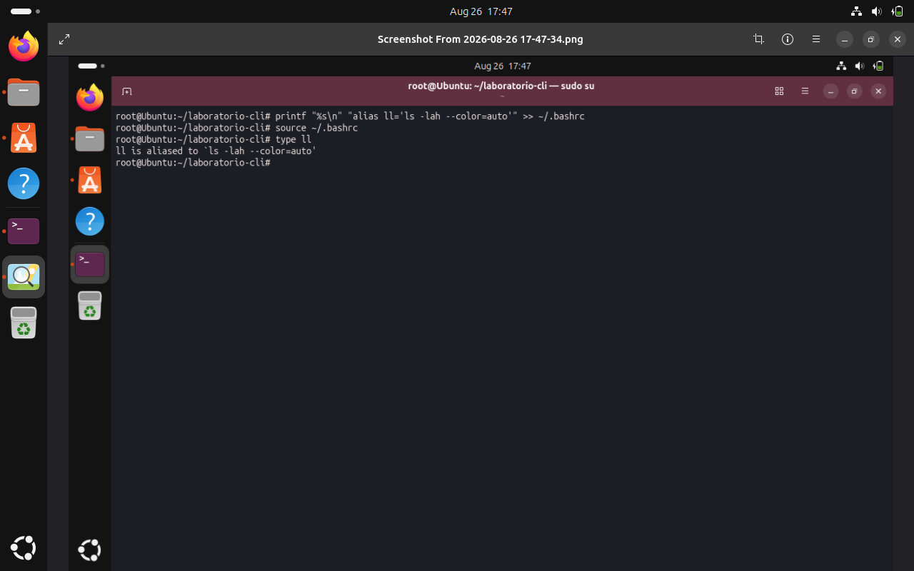
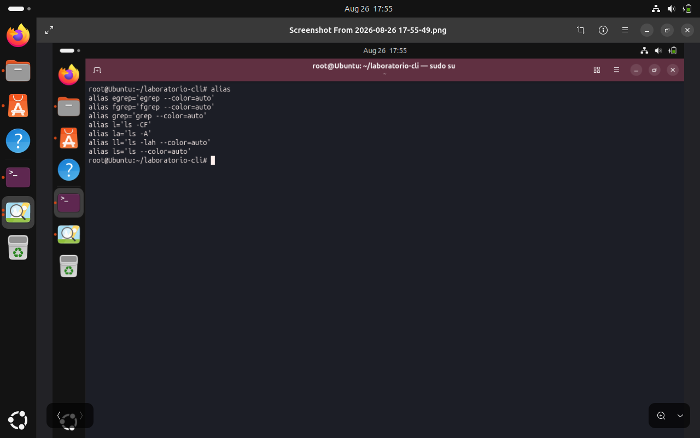

# Explicación de las capturas: creando un alias en Bash

## Captura 1

Busco con `grep` si el alias `ll` ya existe en `~/.bashrc`; el primer intento falla por las comillas, el segundo encuentra uno viejo en la línea 81.

## Captura 2

Con `printf` y `>>` agrego al final de `~/.bashrc` un nuevo alias `ll='ls -lah --color=auto'`.

## Captura 3

Uso `source ~/.bashrc` para que la terminal actual cargue el cambio sin tener que reiniciarla.

## Captura 4

Con `type ll` confirmo que el alias ya apunta a `ls -lah --color=auto`, el nuevo.

## Captura 5

Con `alias` veo todos los alias activos y confirmo que `ll` quedó bien definido junto a los demás.